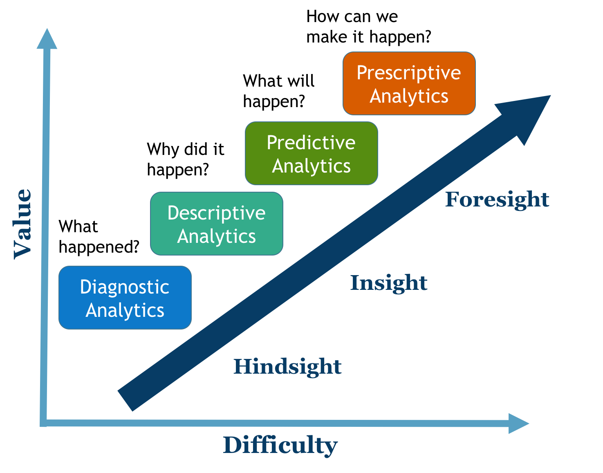

## Visual Analytics with Tableau

##### Introductory workshop using the
##### Global Superstore 2016 dataset.

---

## Business Intelligence (BI)
## &
## Business Analytics (BA)

+++

### Why?

Business Analytics help managers and staff gain **improved insights** about their business operations and make **better, fact-based decisions**.

+++

### How ?

Data transformation processes allow us to turn data into actionable knowledge.

---

## Scope of BI/BA

+++

+++

---

## Tableau

---

## References

+++

#### Slide text and graphics:

* Evans, J. R. (2014). Business analytics: Methods, models, and decisions (2nd Ed). Pearson.
* Sharda, R., Delen, D., & Turban, E. (2013). Business Intelligence: A Managerial Perspective on Analytics. Prentice Hall Press.

+++

#### Video:
* Tableau use case: https://goo.gl/XAG76s

#### Dataset:
* Global SuperStore. Tableau Community: https://goo.gl/1v3MkF
