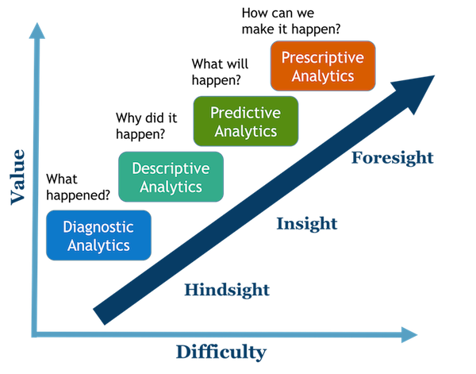

## Visual Analytics with Tableau

##### Introductory workshop using the
##### Global Superstore 2016 dataset.

---

## Business Intelligence (BI)
## &
## Business Analytics (BA)

+++

### Why?

Business Analytics help managers and staff gain **improved insights** about their business operations and make **better, fact-based decisions**.

+++

### How ?

Data transformation processes allow us to turn data into actionable knowledge.

---

## Scope of BI/BA

+++

Various aspects of BA can be categorized descriptive, diagnostic, predictive, and diagnostic analytics. Visual analytics draws from each of the four categories.

+++
Applied processes and methods vary between different analytics scopes. Your objectives will determine which approach best fits your needs.

---
## Visual Analytics

+++
### Visual Analytics is ...

“... an iterative and interactive
approach to analytical reasoning.”

“... used to create interactive,
easy-to-use dashboards,
that show most import information
at a single glance.”

+++
### Approaches to Visual Analytics

1. Exploring data by **creating visualization first** and then interpreting them (_e.g. sales seasonalities_)

2. **Asking questions first**, and then finding the right visualization to answer the question (_e.g. when and where are my sales the highest?_ )

####

---

## Tableau

---

## References

+++

#### Slide text and graphics:

* Evans, J. R. (2014). Business analytics: Methods, models, and decisions (2nd Ed). Pearson.
* Sharda, R., Delen, D., & Turban, E. (2013). Business Intelligence: A Managerial Perspective on Analytics. Prentice Hall Press.

+++

#### Video:
* Tableau use case: https://goo.gl/XAG76s

#### Dataset:
* Global SuperStore. Tableau Community: https://goo.gl/1v3MkF
