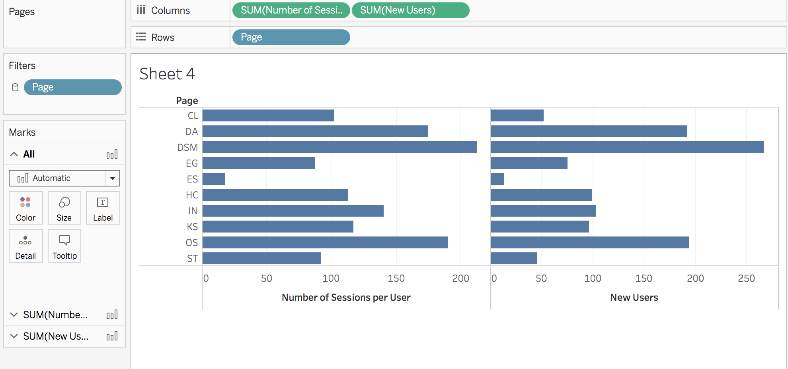
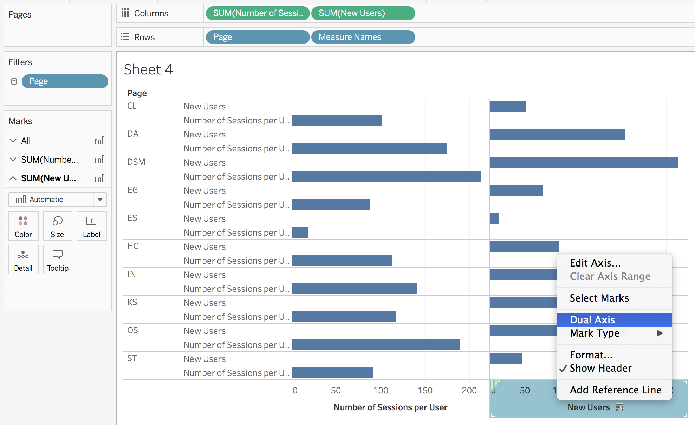
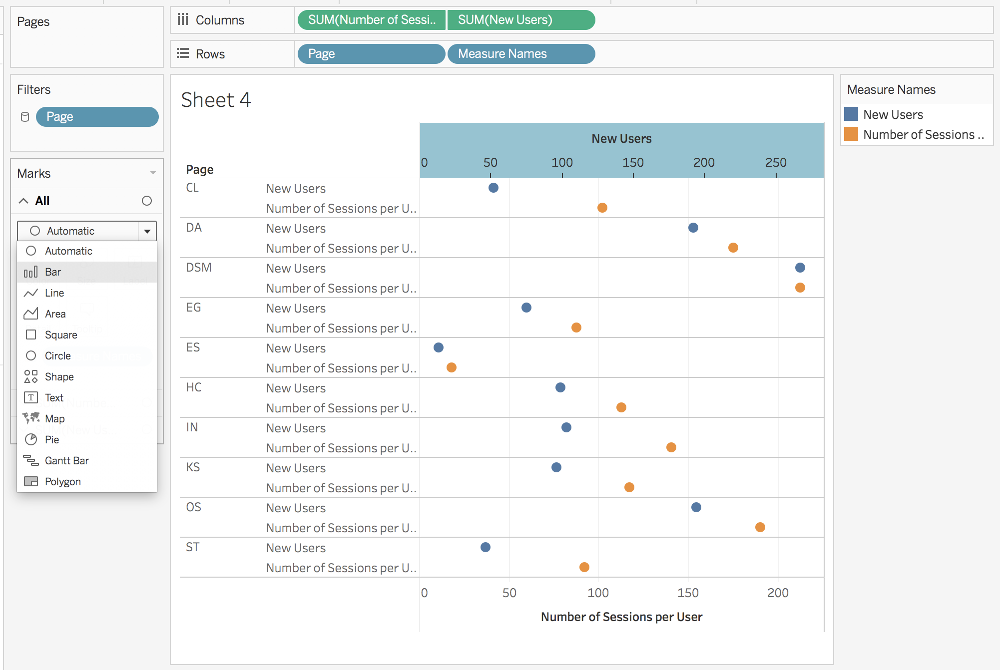
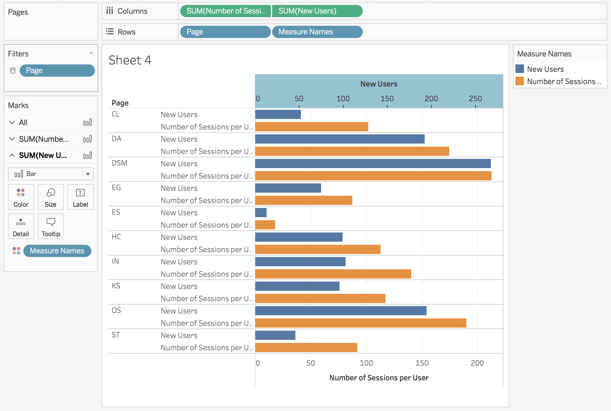

# Creating a Horizontal Bar Chart with Dual Axis

Imagine you have two metrics and want to compare these in a single viz side-by-side. You've chosen to use a horzizontal bar chart and now want to compare the two metrics within each category. The following will walk you through a few simple steps to achieve this.

Let's start with a horizontal bar chart with one metric (column) and one dimension (row). Then we drop our second metric pill into the column shelf.   

By default, these will be split into two separate axes. In order to compare these two metrics within each category, we can add `Measure` names as our second pill in the rows shelf and apply a dual axis. Then we go on over the formatting card for `All` and change the viz from `Circle` to `Bar`.

This looks a lot better, we can now easily compare the two metrics wihtin each category. Final formatting can be applied at this point, such as coloring and sorting. The `pivot` operator could be applied to obtain a vertical bar chart with direct metric comparison.
